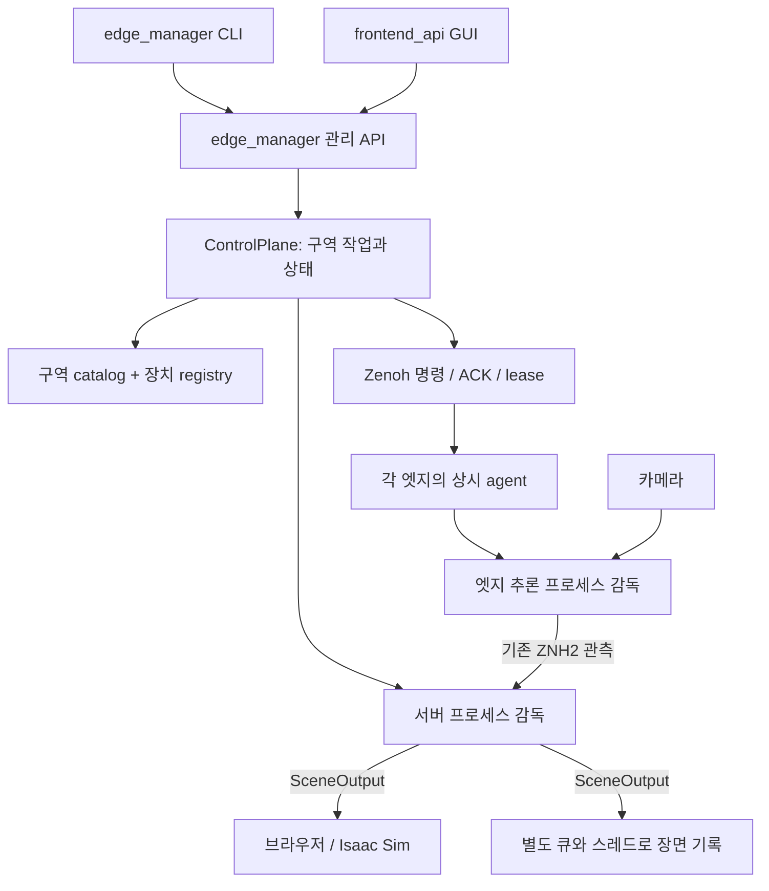

# 구역 단위 분산 디지털 트윈

목표는 여러 카메라 관측을 캠퍼스 좌표계의 사람 위치·자세로 실시간 반영하고, 결과를 기록·재사용할 수 있게 하는 것이다. 사용자는 구역을 선택해 작업을 실행한다. 장치의 실행 순서와 내부 추론 인자를 반복 입력하지 않는다.

## 관리 흐름과 데이터 흐름

## 책임

| 구성 | 소유하는 책임 |
| --- | --- |
| `apps/deployments/regions.json` | 사용자에게 보이는 구역 ID/이름, 공통 배포와 서버 프로파일 참조 |
| 기존 배포 manifest | 참여 엣지, 카메라 순서, 공통 공간·calibration 계약 |
| `EdgeRegistry` | 발견된 장치, 승인, 마지막 연결·카메라 상태 |
| `ControlPlane` | 구역 작업의 단일 소유자, 검증→실행→종료, 명령 및 실제 관측 상태 통합 |
| `EdgeAgent` / `EdgeInferenceRuntime` | 로컬 카메라 설정, 실제 엣지 프로세스, lease 만료에 따른 종료 |
| `ManagedProcess` | 중복 실행 방지, 프로세스 그룹 종료, 유한한 재시도와 로그 |
| `frontend_api` | 동일 API 중계와 화면 표시. 별도 실행 로직을 갖지 않음 |
| 추론 worker | 기존 관측 입력 계약, ReID, 위치 연결, LOD, 자세 추론, SceneOutput |

현재 센터지하1층복도는 `center-b1-corridor`이며 edge_1=2/4/6/8, edge_2=1/3/5/7이다. ID에 소속을 인코딩하지 않는다. 카메라 키는 기존 `{edge_id}/camera/{number}`를 유지한다.

## 상태의 근거

프로세스 생성 성공, agent heartbeat, 유효한 관측은 서로 다른 증거이다. 관리 API는 모두 분리해 반환한다. `running`은 서버 프로세스와 각 agent의 해당 run 소유권, 승인/연결, 새로운 SceneOutput의 `runtime.input_status`가 모두 확인될 때만 표시한다. 오래된 장면이나 재생된 장면을 현재 관측으로 집계하지 않는다.

한 구역의 작업은 직렬화된다. live와 replay/calibration을 같은 구역에서 중복 실행할 수 없다. 시작은 같은 옵션에 대해 멱등이며 옵션 변경은 중지 후 새 run으로 수행한다. 다른 구역은 별도의 작업과 프로세스/토픽을 사용한다. 같은 엣지의 중복 구역 소속과 장면 토픽 중복은 catalog 검증에서 거부한다.

서버 설정을 먼저 검증한 뒤 서버 처리와 엣지 추론을 준비한다. 각 엣지도 자기 환경에서 배포 파일 일치, 카메라 배치, 기존 공간 계약을 검증한다. 서버 검증과 엣지 검증은 설정 검사이며 실제 GPU·카메라 건강의 보증이 아니다. 정상 상태는 실제 데이터로 확인한다.

관리 기능으로 완료한 보정은 엣지 적용 ACK와 좌표계 일치를 확인한 후 `calibration-overrides.json`에 채택한다. 다음 실행에서 해당 엣지에 소속된 카메라만 공통 보정에 병합한다. `dt_common.deployment`가 각 호스트의 지도 파일에 로컬 링크를 만들고, 동일한 상대 경로와 canonical calibration JSON으로 실행 설정을 생성한다. 따라서 설치 경로가 달라도 공간·보정 식별자가 일치한다. 원본 배포/보정 파일은 보존한다. 관리 경로의 모든 호스트는 dt-common 0.3.0과 새 agent를 함께 사용한다.

## 장애와 종료

- 엣지의 실패는 해당 엣지 오류로 표시한다. 다른 엣지 및 독립 입력 모드의 서버 처리는 계속된다.
- 프로세스는 지수 대기로 최대 3회 재시도한다. 한도 초과를 성공으로 숨기지 않는다.
- 엣지는 관리자의 실행 lease를 갱신받는다. 30초 동안 갱신이 없으면 해당 추론을 정지한다. 연결 복구 후 같은 활성 run을 다시 준비할 수 있다.
- 명시적으로 중지한 run은 agent 수명 동안 재실행을 차단한다. 지연된 명령은 만료시각과 run ID로 검사한다.
- manager/agent는 소유권 파일 잠금으로 같은 상태 파일의 중복 소유자를 거부한다. 각 프로세스의 하위 카메라 프로세스도 그룹으로 종료한다.
- systemd는 관리 프로그램 자체의 재시작을 맡고, 관리자 재시작 시 이전 작업은 interrupted로 표시한다. 자동 작업 재개는 하지 않는다.
- 중지 ACK를 받지 못한 엣지가 있으면 API에 표시한다. `stopped`가 모든 원격 장비의 즉각적인 정지를 증명한다고 해석하지 않는다.

## 기록과 개인정보 경계

원본 RTSP 및 인증정보는 엣지 로컬 설정에 유지한다. 원본 영상/특징값을 장면 기록에 추가하지 않는다. 장면 기록은 기존 SceneOutput 형식이며 사람 ID·위치·자세가 포함된다. 데이터 최소화와 법적/운영 정책 적합성이 완성됐다는 주장은 하지 않는다.

운영 기록은 명시적 `record=true`일 때만 시작한다. 기록 큐는 유한하며 누락 수를 표시한다. 기본 파일 크기 제한은 1 GiB (`DT_RECORDING_MAX_BYTES`), 남은 공간이 256 MiB 미만이면 기록을 중단한다. 파일 쓰기는 실시간 추론과 분리되어 실패가 데이터 전송을 막지 않는다. 보관·삭제 기간은 자동 결정하지 않는다.

`data/manager/runs/<run_id>/`에 manifest, 생성된 서버 설정, 로그, 선택적 scenes.jsonl을 둔다. manager 재시작 전에 끝나지 않은 run은 interrupted가 된다. 출력 재생에는 `runtime.playback=true`를 붙인다. 기존 입력 `.dtframe` 재추론 평가 경로와 출력 장면 재생을 구분한다.

## 설치와 보안 경계

라우터, manager, frontend, 각 edge agent는 최초 설치 시 상시 서비스로 준비한다. GUI/CLI는 GPU worker를 시작·중지하며 장비 전원을 원격으로 켜는 기능은 아니다. 관리 API는 기본 loopback이며 외부 바인딩 시 관리 토큰이 필요하다. frontend는 같은 origin 요청만 중계한다. Zenoh 전송 자체는 기존의 신뢰 네트워크/VPN 배치를 전제로 하며, 장치 승인 registry가 네트워크 암호화/인증을 대체하지 않는다.

GUI/API의 보정 작업은 기존 worker를 감독하며 결과를 엣지와 registry에 반영한다. 보정의 실제 품질을 자동으로 보증하지 않으며 다른 좌표계의 결과는 채택하지 않는다. 원본 모델 알고리즘, 카메라 intrinsic 측정, 3D 지도 제작, Rank/Zone 연구 평가의 내부 옵션은 운영 수명주기와 분리된 개발 도구로 유지한다.
