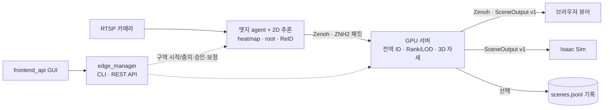

# intelligent-synchronization: 디지털 트윈 동기화 엔진

> `DT_SERVER`는 이 프로젝트의 개발 코드명이며, 저장소 이름과 경로·환경변수에 남아 있습니다.
> 별도의 외부 오픈소스가 아닙니다.

여러 대의 CCTV/RTSP 카메라 관측을 **엣지(Jetson)** 와 **GPU 서버**에서 나누어 처리하고,
사람의 **전역 ID·3D 위치·15관절 자세**를 하나의 3D 장면(`SceneOutput`)으로 동기화하는
분산 디지털 트윈 엔진입니다. 장면은 브라우저 뷰어(Three.js)와 NVIDIA Isaac Sim으로
실시간 전달되고, 필요하면 JSONL로 기록해 재생할 수 있습니다.

- **라이선스**: [LGPL-2.1-or-later](LICENSE). 저작권: 한국전자통신연구원(ETRI), 세종대학교. 제3자 구성요소는 [THIRD_PARTY_NOTICES.md](THIRD_PARTY_NOTICES.md)를 참고합니다.
- **버전**: [CHANGELOG.md](CHANGELOG.md) (Semantic Versioning, `dt-common` 패키지 버전과 동일)
- **문서**: [활용 가이드](docs/guide/README.md) · [아키텍처](ARCHITECTURE.md)



## 주요 기능

| 기능 | 설명 |
| --- | --- |
| 구역(region) 단위 운영 | 카메라·엣지·서버 구성을 구역으로 묶어 CLI/GUI 한 번으로 시작·중지 |
| 엣지-서버 분산 추론 | 엣지는 2D heatmap/root/ReID, 서버는 다중 엣지 결합과 3D 자세(LOD-2) 담당 |
| 우선순위 기반 LOD | 0.5초마다 전역 Rank를 계산해 계산 자원을 중요한 사람에게 배분 |
| 증거 기반 상태 | 프로세스·agent heartbeat·실제 관측 도착을 분리 확인해 `running` 판정 |
| 카메라 보정 | ArUco 마커 트리 + (선택) VGGT-Omega 자동 보정, 수동 보정 편집기 |
| 기록·재생 | 원본 영상이 아닌 `SceneOutput` JSONL만 기록, 브라우저/Isaac에서 재생 |

## 5분 체험 (GPU·카메라 불필요)

합성 장면 파일을 브라우저 뷰어로 재생합니다. 자세한 내용은 [빠른 시작](docs/guide/01-quickstart.md)을 참고합니다.

```bash
git clone --recurse-submodules <이 저장소 URL> DT_SERVER && cd DT_SERVER
python3 -m venv .venv && . .venv/bin/activate
pip install -e packages/dt_common -r apps/frontend_api/requirements.txt
npm ci --prefix apps/frontend_api/web && npm run build --prefix apps/frontend_api/web
python -m uvicorn apps.frontend_api.app.main:app --host 127.0.0.1 --port 8005
# 브라우저에서 http://127.0.0.1:8005/viewer → "JSONL 파일 열기"
#   → examples/synthetic_region/synthetic_scene.jsonl 선택
```

## 실제 배포 순서

1. [서버 설치](docs/guide/02-install-server.md): CUDA PyTorch, Zenoh router, manager, GUI
2. [엣지 설치](docs/guide/03-install-edge.md): Jetson 환경, 카메라 등록, agent 등록·승인
3. [새 구역 구성](docs/guide/05-new-region.md): 배포 manifest, 보정, ground, `regions.json`
4. [운영](docs/guide/06-operations.md): 구역 시작/중지, 상태 판정, 기록·재생, 장애 처리
5. (선택) [Isaac Sim 연동](docs/guide/04-isaac-sim.md)

메시지 형식과 좌표계를 직접 다루려면 [데이터 계약](docs/guide/07-contracts.md),
문제가 생기면 [문제 해결](docs/guide/08-troubleshooting.md)을 봅니다.

## 저장소 구조

| 경로 | 역할 |
| --- | --- |
| `packages/dt_common` | 모든 호스트가 공유하는 CPU 전용 계약 (엣지 토픽, ZNH2 코덱, `SceneOutput`, 보정·공간 기하) |
| `apps/edge_manager` | 구역 실행의 단일 소유자 (`ControlPlane`), 장치 registry, REST API(8001), CLI |
| `apps/edge_client` | Jetson 상시 agent와 엣지 추론 |
| `apps/server_worker` | 서버 추론 루프 (연결 → Rank/LOD → 3D 자세 → 장면 병합) |
| `apps/calibration_worker` | 카메라 보정 worker와 수동 보정 편집기 |
| `apps/frontend_api` | 운영 GUI와 Three.js 장면 뷰어(8005) |
| `apps/isaac_sim_client` | Isaac Sim 장면 구독 스크립트와 확장 |
| `apps/deployments` | 구역 catalog와 배포 manifest 예시 (`center-b1-corridor`) |
| `examples/` | 합성 장면 생성기 등 바로 실행 가능한 예제 |

## 라이선스와 선택 구성요소

intelligent-synchronization 자체는 **GNU LGPL v2.1 이상**으로 배포됩니다. 아래 구성요소는 이 저장소에
**포함되지 않으며**, 필요할 때 사용자가 각 라이선스를 검토한 뒤 직접 설치합니다.

| 구성요소 | 용도 | 라이선스 | 없을 때 |
| --- | --- | --- | --- |
| Ultralytics YOLO | 엣지 ReID용 사람 검출 | AGPL-3.0 | `--no-reid`로 실행 (위치 기반 ID) |
| VGGT-Omega (서브모듈) | 자동 카메라 보정 | FAIR Noncommercial | 수동 보정 편집기 사용 |
| FastReID (서브모듈) | ReID 특징 추출 | Apache-2.0 | `--no-reid` |
| 학습된 PoseNet 가중치 | 2D/3D 추론 | 개발팀 가중치는 CC BY-NC-SA 4.0 (비배포) | 직접 학습해 `DT_POSENET_URL`로 지정 |

자세한 의무 사항은 [라이선스 준수 가이드](docs/guide/09-license-compliance.md)를 참고합니다.

## 참여와 지원

- 버그·질문·제안: GitHub Issues ([SUPPORT.md](SUPPORT.md))
- 기여 방법: [CONTRIBUTING.md](CONTRIBUTING.md)
- 보안 취약점·자격증명 노출 신고: [SECURITY.md](SECURITY.md)

> 이 엔진은 사람의 위치·자세를 다룹니다. 설치 현장의 개인정보 보호 법령과 내부 정책
> (고지, 동의, 보관 기간)을 운영자가 직접 확인해야 하며, 소프트웨어가 그 적합성을
> 보증하지 않습니다.
