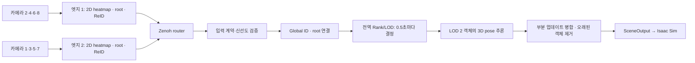

# MetaSejong 분산 추론 PoC 실행

이 실행 구성은 2026-08-14 회의록(`260814 DT PoC 관련 미팅.pdf`, 별도 제공 자료)의 온라인 통합 시연과 오프라인 정량 평가를 구분한다. 사용자가 확정한 Rank/LOD 갱신 기본 주기는 **0.5초**다. 명령은 모두 저장소 루트에서, 해당 장비의 CUDA/TensorRT 추론 환경을 활성화한 뒤 실행한다.

## 공통 계약과 데이터 흐름

세 장비에 같은 코드와 `apps/deployments/scene_0812_poc.json`, 그 파일이 참조하는 calibration JSON 및 ground cache를 배치한다. 이 manifest는 기존 `scene_0812_2.json`의 카메라 배치와 AOI를 사용한다. 로컬 카메라 YAML은 RTSP 접속 정보를 제공하고, 실제 추론 calibration은 공통 manifest에서 읽는다. 개인 RTSP URL과 장비 identity 파일은 Git에 추가하지 않는다.

| 장비 | ID | 카메라 순서 | 추론 토픽 |
| --- | --- | --- | --- |
| 엣지 1 | `edge_1` | 2, 4, 6, 8 | `dt/edges/edge_1/inference` |
| 엣지 2 | `edge_2` | 1, 3, 5, 7 | `dt/edges/edge_2/inference` |
| 서버 → Isaac Sim | 공통 SceneOutput | USD world, Z-up | `meta-sejong/scene/v1` |



서버는 엣지마다 4개 view의 pose 모델을 실행한다. 같은 Global ID가 여러 엣지에서 잡히면 연결된 root를 선택하는 구조이며, 8개 view 전체를 한 모델에서 동시에 융합하는 구조는 아니다.

전송은 `dt-common 0.2.0`의 **ZNH2** 계약을 사용한다. JSON metadata와 제한된 dtype의 ndarray buffer를 zstd로 압축하며, pickle을 역직렬화하지 않는다. 카메라 순서, effective calibration digest, scene/workspace ID, tensor 크기, 시계 종류, session/sequence를 검사한다. 구버전 ZNH1 패킷은 거부하므로 양쪽 추론기를 함께 업데이트한다.

기존 추론 환경에서 공통 패키지를 갱신한다. NumPy, zstandard, eclipse-zenoh 등은 저장소의 기존 requirements에 포함되어 있다.

```bash
python -m pip install --no-deps -e packages/dt_common
```

## 위험점과 시간 설정

`meta_sejong_script.py`가 기본으로 여는 `/home/dojan/All/2025_SejongUniv_All.usd`와 개발 호스트의 `Ground.usd`를 직접 읽어 확인한 `metersPerUnit`은 모두 **0.01**, up-axis는 **Z**였다. 사용자에게 받은 stage 좌표 `(9076, 682)`는 따라서 USD world의 **`(90.76 m, 6.82 m)`**다. 이 값과 변환 근거를 manifest의 `poc.hazards_metres`, `poc.hazard_source`에 기록했다. 다른 USD나 다른 prim의 로컬 좌표를 사용한다면 world 변환을 먼저 적용하고 이 설정을 수정한다.

모델 root와 SceneOutput 좌표는 mm, 우선순위 입력은 m, Isaac 표시 좌표는 stage unit이다. 현재 Isaac 스크립트가 root mm를 m로 바꾼 뒤 stage의 단위를 적용하므로 별도 스크립트 수정은 필요하지 않다. 위험점은 한 점이며 반경이나 위험 구역 polygon을 뜻하지 않는다.

| 항목 | 온라인 기본값 | 의미 |
| --- | --- | --- |
| `priority_interval` | 0.5 s | 입력이 들어온 첫 decision tick부터 다음 갱신까지 Rank/LOD 유지 |
| `lambda_aoi` | 0 | hazard_score만으로 Rank 결정 |
| `lod2_count` | 1 | 전체 엣지에 걸친 LOD 2 객체 수 |
| `rtsp_buffer_frames` | 4 | 카메라별 최근 프레임 ring |
| `rtsp_max_skew`, `sync_tolerance` | 0.03 s | 한 엣지의 카메라 수신 시각 허용 차이 |
| `max_input_age` | 0.75 s | 입력 및 유지한 객체의 최대 관측 경과 시간 |
| `future_tolerance` | 0.1 s | 호스트 시계 차이에 대한 미래 입력 허용 범위 |
| `input_mode` | independent | 한 엣지가 끊겨도 다른 엣지 처리 계속 |

Rank 정책에서 중간에 새로 나타난 객체는 다음 tick까지 LOD 1이다. ReID가 잠시 실패하면 root 근접 연결로 임시 ID를 부여한다. 임시 ID는 `1000000000`부터 시작하고, 확정 ID로 바뀔 때 기존 LOD와 scene 상태를 연결한다. 임시 연결은 거리 750 mm, 중복 억제는 250 mm를 사용하므로 교차 보행이나 밀집 상황의 ID 정확도는 리허설에서 확인해야 한다. `--no-root-fallback`으로 끌 수 있다.

RTSP 시간은 OpenCV가 프레임을 받은 시각인 **`receive_unix`**다. 센서 노출 시각을 측정한 값이 아니며 디코더 내부 지연까지 알아내지는 못한다. 세 호스트의 NTP/PTP 상태와 카메라 자체 동기화를 확인한다. 서로 다른 엣지의 관측 시각은 달라도 처리하고, 각 root의 원래 timestamp를 유지한다. 따라서 느린 엣지가 빠른 엣지 때문에 계속 버려지지 않는다. 0.5초 주기는 관측 입력에 따라 갱신되므로 추론이 느리거나 입력이 없으면 그보다 늦어질 수 있다.

## 온라인: 두 엣지 + 한 서버

아래 `SERVER_IP`는 엣지와 Isaac Sim에서 접근할 수 있는 서버 LAN 주소로 바꾼다. TCP 7447을 사용할 수 있어야 한다. 기존 QUIC 설정 대신 이 PoC의 모든 구성 요소는 동일한 TCP router를 사용한다.

서버에서 router와 manager를 각각 실행한다.

```bash
zenohd -c apps/edge_manager/config/zenoh-router-poc.json5
```

```bash
python -m apps.edge_manager --endpoint tcp/127.0.0.1:7447 serve
```

엣지 1에서 identity를 한 번 만들고 agent를 실행한다. 기존 `edge.local.json`은 이 프로파일에서 사용하지 않는다.

```bash
python apps/edge_client/agent.py init \
  --identity-file apps/edge_client/config/edge_1.poc.json \
  --edge-id edge_1 --display-name poc-edge-1 \
  --endpoint tcp/SERVER_IP:7447 \
  --camera-config apps/edge_client/config/cameras.local.yaml \
  --deployment apps/deployments/scene_0812_poc.json --tensorrt

python apps/edge_client/agent.py run \
  --identity-file apps/edge_client/config/edge_1.poc.json
```

엣지 2에서는 위 명령의 `edge_1`을 `edge_2`, 표시 이름을 `poc-edge-2`로 바꾼다. 카메라 YAML에 8개 카메라가 있어도 각 엣지에는 manifest에 지정한 4개만 순서대로 선택된다. 두 파일을 서로 다른 장비에 복사할 때도 각 장비의 RTSP 접속 정보를 유지한다.

서버에서 등록을 확인하고 최초 승인한다. 이 승인은 기존 manager 등록 절차이며, 추론 구독기는 manifest의 enabled edge를 기준으로 동작한다. 승인 registry가 추론 접근을 자동으로 차단하는 구조는 아니다.

```bash
python -m apps.edge_manager --endpoint tcp/127.0.0.1:7447 list
python -m apps.edge_manager --endpoint tcp/127.0.0.1:7447 \
  approve edge_1 --edge-endpoint tcp/SERVER_IP:7447
python -m apps.edge_manager --endpoint tcp/127.0.0.1:7447 \
  approve edge_2 --edge-endpoint tcp/SERVER_IP:7447
```

각 장비에서 먼저 설정만 검증한다. 이 명령은 카메라 연결·GPU 추론·네트워크 연결을 시도하지 않는다.

```bash
# 서버
python apps/server_worker/inference.py \
  --runtime-config apps/deployments/poc/server.online.json --validate-only

# 엣지 1 (엣지 2에서는 edge_2.online.json)
python apps/edge_client/inference.py \
  --runtime-config apps/deployments/poc/edge_1.online.json --validate-only
```

그다음 각각의 터미널에서 `--validate-only`를 빼고 실행한다. 서버 프로파일은 회의 내용에 맞춰 metrics, trajectory, decision 파일을 기본 저장하지 않는다. SceneOutput만 Zenoh로 발행하며 ZMQ는 비활성화한다.

Isaac Sim을 실행하는 환경에 endpoint와 필요한 USD 경로를 지정한 뒤, 기존 방법으로 `apps/isaac_sim_client/meta_sejong_script.py`를 실행한다.

```bash
export ISAAC_ZENOH_ENDPOINT=tcp/SERVER_IP:7447
export ISAAC_USD_PATH=/path/to/2025_SejongUniv_All.usd
```

JSON 프로파일 내부의 경로는 **그 프로파일 파일 기준**이다. CLI 경로는 실행 위치 기준이며 CLI 값이 프로파일 값보다 우선한다. 예를 들어 `--priority-interval 1.0`으로 주기를 변경할 수 있다. 서버의 위험점을 직접 바꾸려면 `--priority-hazard X Y`를 m 단위로 지정한다. 온라인 엣지 프로파일은 identity 초기화와 명시적 endpoint 설정이 없으면 즉시 중단한다.

## 오프라인: 동일한 입력으로 Rank/Zone 비교

동기화된 8/12 영상에서 엣지 출력을 한 번 기록하고 그 **동일한 패킷**을 두 정책에 재생한다. 온라인의 최신 프레임 우선 queue/drop 동작은 정량 평가에 사용하지 않는다. 양쪽 녹화 입력은 같은 시작 프레임과 FPS여야 한다. 영상 파일명은 기존 입력기가 지원하는 `camera_1.mp4`/`camera_1.mkv` 등의 형식을 사용한다.

각 엣지의 추론 환경에서 다음을 실행한다. 엣지 2는 프로파일명을 `edge_2.record.json`으로 바꾼다. 데이터셋은 manifest와 동일한 calibration/좌표 계약을 가져야 한다.

```bash
python apps/edge_client/inference.py \
  --runtime-config apps/deployments/poc/edge_1.record.json \
  --example-folder /path/to/recorded_dataset \
  --record-output /path/to/poc-inputs
```

이 모드는 Zenoh 없이 모든 처리 결과를 `poc-inputs/edge_1/000000000.dtframe` 형태로 기록한다. 엣지 2의 폴더를 같은 `poc-inputs` 아래로 모은다. 기록 폴더에 기존 `.dtframe` 파일이 있으면 덮어쓰지 않고 중단한다. 두 엣지의 마지막 프레임 수가 다르면 동일 구간을 정해 `--max-frames N`으로 다시 기록한다.

서버에서 두 번 재생한다. 각 JSONL 출력 경로는 새 파일이어야 한다.

```bash
python apps/server_worker/inference.py \
  --runtime-config apps/deployments/poc/server.offline.rank.json \
  --replay-inputs /path/to/poc-inputs \
  --decision-output /path/to/rank.jsonl

python apps/server_worker/inference.py \
  --runtime-config apps/deployments/poc/server.offline.zone.json \
  --replay-inputs /path/to/poc-inputs \
  --decision-output /path/to/zone.jsonl
```

재생은 dataset-relative clock, strict 동기화, 1 ms 허용 차이를 사용한다. 프레임 불일치·손상·calibration 오류·한쪽 조기 EOF를 발견하면 실패 처리한다. 두 정책 모두 EOF까지 성공한 결과만 비교한다. `--max-batches N`은 짧은 smoke test에 사용할 수 있다.

기본 Zone 비교군은 기존 엣지별 LOD 구성에 대응하는 **edge_1=2, edge_2=1**이다. 회의록에는 최종 Zone 경계가 없으므로 실제 비교하려는 구역 정의가 다르면 `server.offline.zone.json`의 `lod_edge_zones`를 수정하거나 `lod_zones`에 `{ "polygon_xy_m": [[x,y], ...], "lod": 2 }`를 지정한다. polygon에 속하지 않은 객체는 해당 edge LOD, 그것도 없으면 LOD 1이다. 겹치는 polygon은 높은 LOD를 적용한다. polygon 좌표는 위험점처럼 USD world m다. Zone은 선택 인원수가 가변이므로 runtime과 함께 실제 선택 인원수도 비교한다.

### 실제 미래 궤적에 의한 Oracle

참조 CSV의 열은 `timestamp_s,global_id,x_mm,y_mm`다. 시작 시각은 재생 영상의 0초, 좌표는 동일한 USD world mm여야 한다. 실제 위치의 정답 궤적과 ID 대응을 준비한 후 실행한다.

```bash
python -m apps.server_worker.poc_evaluation \
  --rank-decisions /path/to/rank.jsonl \
  --zone-decisions /path/to/zone.jsonl \
  --trajectories /path/to/ground_truth.csv \
  --trajectory-kind ground-truth --ids-aligned \
  --output /path/to/new-evaluation-result
```

ID가 서로 다르면 `--ids-aligned` 대신 `--identity-map /path/to/id-map.json`을 사용한다. JSON은 `{"추론ID": 정답ID}` 형태의 일대일 대응이다. 추론 root CSV만 확보한 경우에는 반드시 `--trajectory-kind estimated`로 실행하며, 결과도 정답 Oracle이 아닌 `estimated_trajectory_proxy`로 표시된다.

평가식은 회의록의 `전체 객체 Oracle 위험지수 합 − LOD 2 선택 객체 Oracle 위험지수 합`이다. 추정 속도로 외삽한 미래 대신 참조 궤적의 실제 미래 위치와 구간 속도에 온라인 엔진의 동일한 urgency kernel을 적용한다. 기본 4스텝, 0.5초 간격으로 2초 미래까지 할인 누적한다. 궤적 구간은 선형 보간하며 0.2초 이상 벌어진 구간은 기본적으로 유효하지 않다. 미래가 부족한 프레임은 제외 사유와 함께 기록한다. 추론에서 검출하지 못한 정답 객체도 전체 위험지수에 포함된다.

출력은 `summary.json`, `per_frame.jsonl`이다. Rank/Zone 입력 패킷 SHA256·관측값·ID·timestamp·위험점·주기·AoI 설정의 일치를 확인한 후 점수를 계산한다. pose GPU runtime은 CUDA event 완료를 기다려 측정한다. pipeline compute runtime은 ReID, root 연결, LOD, pose, scene 구성의 합이며 입력 파일 읽기·전송·결과 파일 쓰기는 제외한다. 기본적으로 처음 10 batch는 runtime 통계에서만 제외하고 평균/p50/p95를 보고한다. 실제 장비에서 같은 GPU, backend, 입력 구간으로 여러 번 실행해 초기화와 부하 영향을 확인한다.

## 리허설과 현재 검증 범위

1. 서버와 양쪽 엣지의 validate-only가 통과하고, 로그의 camera order, calibration/workspace 계약이 맞는지 확인한다.
2. 두 엣지에서 프레임 수가 증가하고 서버 SceneOutput의 `runtime.input_status`가 모두 online인지 확인한다. `runtime.priority`에 위험점, 0.5초 간격, AoI=0, rank가 포함된다.
3. 위험점 근처로 이동하는 사람이 다음 decision tick에서 LOD 2가 되는지 확인한다. 해당 구간의 선택 ID가 tick 사이에 불필요하게 바뀌지 않아야 한다.
4. 엣지 하나의 추론을 정지했을 때 다른 엣지 처리가 계속되고, 멈춘 엣지의 오래된 객체가 0.75초 관측 TTL 뒤 제거되는지 확인한다. 재시작 후 같은 논리 edge ID의 새 session을 수용해야 한다.
5. 실제 지연이 0.75초보다 크면 서버가 정상적으로 오래된 입력을 거부할 수 있다. 초기 model warmup과 지속적인 처리 지연을 구분하고, 실제 측정에 따라 처리 부하나 age/skew 설정을 조정한다.

개발 호스트에서는 CPU 자동 테스트, 실제 배포 calibration/ground cache에 대한 양쪽 엣지 및 세 서버 프로파일 설정 검증, 실제 Zenoh 1.9 로컬 TCP 송수신을 확인했다. CUDA 추론, 실제 RTSP 노출 동기화, 두 Jetson과 서버 사이의 지연/FPS, Isaac Sim 렌더링을 포함한 현장 E2E는 아직 검증하지 않았다. 개발 실행 환경에서 CUDA driver를 사용할 수 없어 이 부분의 성능 수치를 제시하지 않는다.

## 코드 위치

- `packages/dt_common`: ZNH2 codec, calibration digest, bounded publisher, 프로파일 해석.
- `apps/edge_client/src/utils/input.py`: 카메라별 ring과 시각을 함께 잠근 프레임 묶음.
- `apps/server_worker/src/protocol/synchronization.py`: 네트워크/GPU와 분리한 입력 검증 및 scheduling.
- `apps/server_worker/src/protocol/replay.py`: drop 없는 파일 입력.
- `apps/server_worker/lod_scheduler.py`: 전역 관측 상태와 고정 주기 Rank/LOD.
- `apps/server_worker/root_tracks.py`, `scene_state.py`: 임시 ID 연결과 엣지별 최근 scene 상태.
- `apps/server_worker/poc_evaluation.py`: 미래 궤적 기준 정책 비교와 runtime 요약.

기존 `inference.py`는 이 구성요소를 조합하는 실행 루프로 유지한다. 실제 8-view 융합이 필요해지면 입력의 노출 시각 동기화 계약과 camera-set 단위 모델을 먼저 확장해야 한다.
