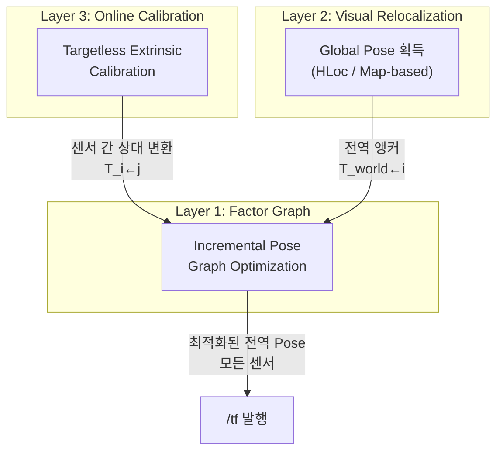
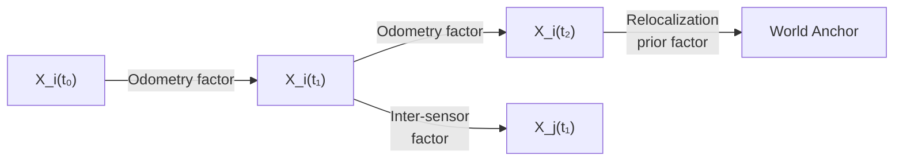
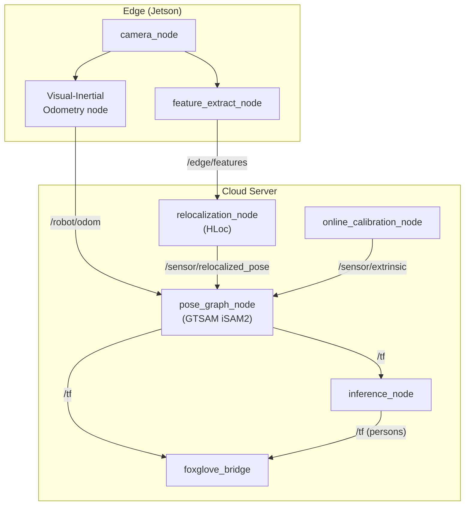

# 다중 센서 전역 Pose 및 상대 Extrinsic 연속 추정 아키텍처

## 목차
1. [문제 정의](#1-문제-정의)
2. [현재 시스템의 한계](#2-현재-시스템의-한계)
3. [핵심 접근법 3계층](#3-핵심-접근법-3계층)
4. [Layer 1: Factor Graph 기반 연속 최적화](#4-layer-1-factor-graph-기반-연속-최적화)
5. [Layer 2: Visual Relocalization (전역 Pose 획득)](#5-layer-2-visual-relocalization)
6. [Layer 3: Online Targetless Extrinsic Calibration](#6-layer-3-online-targetless-extrinsic-calibration)
7. [ROS 2 / TF2 통합 설계](#7-ros-2--tf2-통합-설계)
8. [구현 로드맵](#8-구현-로드맵)

---

## 1. 문제 정의

> [!IMPORTANT]
> **핵심 질문**: 대규모 실내·외 환경에서 N개의 이동형/고정형 센서가 존재할 때, 각 센서의 **전역 pose** `T_world←sensor_i(t)`와 센서 간 **상대 extrinsic** `T_sensor_i←sensor_j(t)`를 시간에 따라 어떻게 **지속적으로(continuously)** 추정할 것인가?

### 왜 어려운가?

| 난제 | 설명 |
|:---|:---|
| **Scale** | 수십~수백 대의 센서. 전체 상태 벡터 차원 = `6 × N` (SE(3) per sensor) |
| **Heterogeneity** | RGB 카메라, LiDAR, IMU, UWB 등 서로 다른 modality가 혼재 |
| **Mobility** | 일부 센서는 고정(CCTV), 일부는 이동(로봇, 드론, 핸드헬드) |
| **Drift** | 이동형 센서의 odometry는 시간이 지날수록 누적 오차(drift) 발생 |
| **환경 변화** | 조명, 날씨, 계절, 동적 객체가 appearance를 바꿈 |
| **통신 제약** | WAN/LTE 환경에서 모든 raw 데이터 전송 불가 |

---

## 2. 현재 시스템의 한계

현재 Meta-Sejong의 [ros2_main.py](file:///home/dojan/DT_SERVER/apps/dl_worker/app/ros2_main.py)는 **정적 캘리브레이션**에 의존합니다:

```python
# ros2_main.py L40-L64 — 캘리브레이션은 Camera Manager에서 1회 가져와 캐싱
async def get_camera_calibration(self, edge_id, camera_id):
    cache_key = f"{edge_id}_{camera_id}"
    if cache_key in self.calib_cache:        # ← 한 번 캐싱하면 영원히 재사용
        return self.calib_cache[cache_key]
```

**문제점:**
- 센서가 이동하거나 진동으로 위치가 바뀌면 캐싱된 extrinsic이 **stale** 해짐
- 새 센서 추가 시 수동 캘리브레이션 필요
- 전역 좌표계(`world` frame)에 대한 절대 위치를 **사전에 측량** 해야 함
- 이동형 센서(로봇, 드론)는 아예 지원 불가

---

## 3. 핵심 접근법 3계층

문제를 3개 계층으로 분리하면 각각을 독립적으로 발전시킬 수 있습니다:



| Layer | 역할 | 대표 기술 |
|:---:|:---|:---|
| **1** | 모든 관측을 통합하는 **백엔드 최적화기** | GTSAM, g2o, Ceres (iSAM2) |
| **2** | 이동형 센서의 **전역 위치**를 지도에 대해 결정 | HLoc, NetVLAD + SuperGlue, NeRF-Loc |
| **3** | 센서 쌍 간의 **상대 변환**을 온라인으로 추정 | Overlap 기반 mutual feature matching, ICP |

---

## 4. Layer 1: Factor Graph 기반 연속 최적화

### 4.1 핵심 아이디어

센서 pose를 **그래프의 노드**, 관측(odometry, relocalization, inter-sensor constraint)을 **edge(factor)**로 모델링하여 **MAP 추정**을 수행합니다.



### 4.2 Factor 유형 정리

| Factor 유형 | 수식 | 소스 |
|:---|:---|:---|
| **Odometry** | `T_i(t) ⊕ ΔT_odom = T_i(t+1)` | Visual/LiDAR SLAM, wheel encoder |
| **Relocalization Prior** | `T_world←i(t) = T_relocalized` | Layer 2 (HLoc 등) |
| **Inter-sensor** | `T_i(t) ⊕ T_i←j = T_j(t)` | Layer 3 (overlap matching) |
| **GPS/GNSS Prior** | `position_i(t) ∈ N(μ_gps, Σ_gps)` | RTK-GPS (실외) |
| **Loop Closure** | `T_i(t_a) ⊕ ΔT_loop = T_i(t_b)` | Place recognition |

### 4.3 GTSAM iSAM2 — Incremental 솔루션

**왜 iSAM2인가?** 매 관측마다 전체 그래프를 재최적화하면 `O(N³)`. iSAM2는 Bayes Tree를 이용하여 **변경된 부분만** 업데이트 → `O(k log N)` (k = 영향받은 변수 수).

```
핵심 흐름:
1. 새 odometry → BetweenFactor 추가
2. 새 relocalization → PriorFactor 추가  
3. 새 inter-sensor match → BetweenFactor 추가
4. isam.update() → 영향받은 노드만 재선형화
5. 최적 pose 추출 → /tf 발행
```

### 4.4 고정 vs 이동형 센서 처리

| | 고정 센서 (CCTV) | 이동형 센서 (로봇) |
|:---|:---|:---|
| **노드 생성** | 단일 노드 (시간 불변) | 매 timestep 새 노드 |
| **Prior 강도** | 높은 confidence (σ ≈ 1cm) | GPS/reloc에 따라 가변 |
| **Odometry** | 없음 (또는 진동 보상용 미세 이동) | Visual/LiDAR SLAM |
| **Drift 보정** | 불필요 | Loop closure + relocalization |

---

## 5. Layer 2: Visual Relocalization

### 5.1 목표

이동형 센서가 자신의 **전역 좌표(T_world←self)**를 사전 구축된 3D 맵에 대해 결정하는 것.

### 5.2 Hierarchical Visual Localization (HLoc) 파이프라인

```
┌───────────────────────────────────────────────────┐
│          HLoc Pipeline (Sarlin et al.)            │
│                                                   │
│  1. Image Retrieval (coarse)                      │
│     NetVLAD / SALAD / CosPlace                    │
│     → DB에서 Top-K 유사 이미지 검색               │
│                                                   │
│  2. Local Feature Matching (fine)                 │
│     SuperPoint + LightGlue (or SuperGlue)         │
│     → 2D-2D 대응점 추출                           │
│                                                   │
│  3. Pose Estimation                               │
│     PnP-RANSAC (2D query ↔ 3D map points)         │
│     → T_world←query 산출                          │
└───────────────────────────────────────────────────┘
```

### 5.3 사전 맵 구축 (오프라인)

| 단계 | 도구 | 산출물 |
|:---|:---|:---|
| 데이터 수집 | 스마트폰 / 드론 / 매핑 로봇 | 다시점 이미지 |
| SfM 재구성 | COLMAP / GLOMAP | Sparse 3D point cloud + camera poses |
| Feature DB | HLoc `extract_features` | `.h5` descriptor DB |

### 5.4 실외·실내 전환 전략

| 환경 | 추천 방법 | 비고 |
|:---|:---|:---|
| **실외 (넓은 영역)** | GNSS → HLoc refinement | GPS coarse → visual fine |
| **실내 (GPS 불가)** | HLoc only / UWB anchor | UWB로 coarse, visual로 fine |
| **전환 구간** | Seamless handoff | GPS confidence 하락 시 HLoc fallback |

---

## 6. Layer 3: Online Targetless Extrinsic Calibration

### 6.1 목표

FOV가 겹치는(overlapping) 또는 겹치지 않는(non-overlapping) 센서 쌍 간의 **상대 변환 T_i←j**를 타겟 보드 없이 온라인으로 추정.

### 6.2 Overlapping FOV (카메라-카메라)

```
Camera_i ─────┐
              │ Shared scene observation
Camera_j ─────┘
              ↓
    Feature Matching (SuperPoint + LightGlue)
              ↓
    Essential/Fundamental Matrix → Relative Pose
              ↓
    Scale resolution via:
      • Known 3D structure (맵 포인트)
      • Tracked object 크기
      • LiDAR depth
```

### 6.3 Non-overlapping FOV

FOV가 겹치지 않는 경우 직접 feature matching이 불가능합니다:

| 방법 | 원리 | 정확도 |
|:---|:---|:---|
| **Shared object tracking** | 동일 객체가 양쪽 센서를 순차 통과 | ±10cm |
| **Hand-eye calibration** | 로봇 팔 등 known motion platform 활용 | ±1mm |
| **Mutual localization** | 각자 Layer 2 relocalize → 전역 좌표 차이로 산출 | ±5cm |

### 6.4 카메라-LiDAR Cross-modal

| 방법 | 설명 |
|:---|:---|
| **Edge alignment** | LiDAR depth discontinuity ↔ 이미지 edge 정합 |
| **Mutual Information** | 두 modality의 MI 최대화 (direct 방법) |
| **Learned matching** | CorrI2P, DeepI2P 등 학습 기반 2D-3D 정합 |

---

## 7. ROS 2 / TF2 통합 설계

### 7.1 TF2 Tree 설계

현재 시스템은 `world → person_N` 단일 계층입니다. 센서 pose를 포함하려면 TF tree를 확장해야 합니다:

```
world (ECEF or local ENU)
├── map (SLAM reference frame)
│   ├── sensor_fixed_01 (CCTV)
│   ├── sensor_fixed_02 (CCTV)
│   └── robot_01/base_link
│       ├── robot_01/camera_front
│       └── robot_01/lidar_top
├── person_01 (추론 결과)
├── person_02
└── ...
```

### 7.2 제안 노드 아키텍처



### 7.3 토픽 설계

| 토픽 | 메시지 타입 | QoS | 발행자 |
|:---|:---|:---|:---|
| `/robot_01/odom` | `nav_msgs/Odometry` | Reliable | VIO node |
| `/sensor/relocalized_pose` | `geometry_msgs/PoseWithCovarianceStamped` | Reliable | relocalization_node |
| `/sensor/extrinsic` | `geometry_msgs/TransformStamped` | Reliable | calibration_node |
| `/tf` | `tf2_msgs/TFMessage` | Reliable | pose_graph_node |
| `/tf_static` | `tf2_msgs/TFMessage` | Transient Local | 초기 캘리브레이션 |

### 7.4 ros2_main.py 개선 방향

```diff
 # 현재: 정적 캘리브레이션 1회 캐싱
-async def get_camera_calibration(self, edge_id, camera_id):
-    cache_key = f"{edge_id}_{camera_id}"
-    if cache_key in self.calib_cache:
-        return self.calib_cache[cache_key]

 # 개선: TF2 Buffer에서 실시간 lookup
+from tf2_ros import Buffer, TransformListener
+
+self.tf_buffer = Buffer()
+self.tf_listener = TransformListener(self.tf_buffer, self)
+
+def get_sensor_pose(self, sensor_frame: str) -> TransformStamped:
+    """TF2에서 실시간 센서 pose를 lookup"""
+    return self.tf_buffer.lookup_transform(
+        'world', sensor_frame, rclpy.time.Time()
+    )
```

---

## 8. 구현 로드맵

### Phase 1: 고정 센서 자동 캘리브레이션 (2주) ✅

- [x] COLMAP으로 현장 SfM 맵 구축 — 90/92 이미지 등록, 11,459 3D pts, 0.806px reproj error
- [x] 각 고정 카메라의 전역 pose를 PnP로 자동 추정 — SIFT(0.0008 err) + HLoc SuperPoint+LightGlue(0.003 err, 90x faster)
- [x] `/tf_static`으로 발행하여 수동 입력 제거 — `static_pose_publisher.py` + `ros2_main.py` TF2 리팩토링 완료

### Phase 2: 이동형 센서 지원 (3주) 🔧 In Progress

- [x] Visual-Inertial Odometry 통합 — `vio_bridge_node.py` (ORB-SLAM3/Kimera/VINS/Stub 지원)
- [x] HLoc relocalization 서비스 노드 구축 — `relocalization_node.py` (SuperPoint+LightGlue+PnP 래핑)
- [x] GTSAM iSAM2 pose graph 노드 구현 — `pose_graph_node.py` + `pose_graph_manager.py`
- [x] ROS 2 Launch 파일 — `phase2_launch.py` (5개 노드 통합 기동)
- [ ] Docker 컨테이너 통합 빌드 및 E2E 테스트
- [ ] 실제 이동형 센서(로봇) 연동 테스트

### Phase 3: 센서 간 Online Calibration (2주) ✅

- [x] Overlapping FOV 센서 쌍 자동 감지 — `overlap_detector.py` (SuperPoint+LightGlue+Essential RANSAC, Collabolab 실측 inlier_ratio 45.7%)
- [x] SuperPoint + LightGlue 기반 상대 pose 추정 — `relative_pose_estimator.py` (Essential→R,t 분해, SfM scale resolution, 실측 reproj 0.58px)
- [x] Factor Graph에 inter-sensor factor 통합 — `online_calibration_manager.py` + `pose_graph_node._extrinsic_callback` (BetweenFactor 주입, temporal smoothing 적용)
- [x] ROS 2 노드 + Launch — `online_calibration_node.py` + `phase3_launch.py` (6개 노드 통합 기동)
- [x] 통합 테스트 — `test_online_calibration.py` 7/7 통과

### Phase 4: 대규모 확장 및 Drift 보정 (2주) ✅

- [x] GPS/UWB prior factor 통합 — `anchor_bridge_node.py` (GPS/UWB 좌표 변환 및 PriorFactor 투입)
- [x] 분산 pose graph (서브맵 분할) 지원 — `submap_manager.py` (다중 `PoseGraphManager` 라우팅 및 관리)
- [x] 실시간 성능 최적화 (< 50ms per update cycle) — `pose_graph_node.py` (target_update_ms 기반 타이밍 최적화 및 adaptive relinearization)

---

## 참고 문헌 및 도구

| 카테고리 | 이름 | 링크 / 비고 |
|:---|:---|:---|
| Factor Graph | **GTSAM** | Georgia Tech, C++/Python, iSAM2 내장 |
| Factor Graph | **g2o** | 경량, Pose Graph SLAM 표준 |
| Visual Localization | **HLoc** | ETH Zürich, Sarlin et al. |
| Feature Matching | **LightGlue** | SuperGlue 후속, 경량화 |
| Visual SLAM | **ORB-SLAM3** | Multi-map, IMU 융합 |
| Visual SLAM | **Kimera** | MIT, 실시간 metric-semantic SLAM |
| Cross-modal | **CorrI2P** | 학습 기반 이미지-포인트클라우드 정합 |
